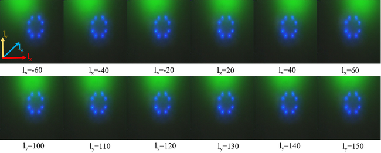
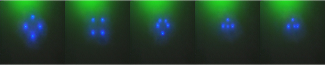
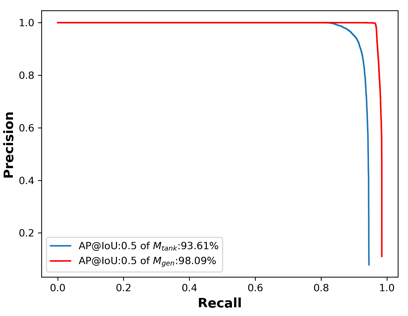

<h1 align="center">
  <a name="logo"></a>
  <br>
A Generative Model of Underwater Images for Active Landmark
Detection and Docking</h1>
<h4 align="center">by <a href="https://github.com/vincent341/ShuangLiu.cv/blob/master/Resume.md">Shuang Liu</a>, Mete Ozay, Hongli Xu, Yang Lin, Okatani Takayuki</h4>

## Table of Contents
* [Introduction](#Introduction)
* [Implementation](#Implementation)
  * [Prerequists](#Prerequists)
  * [Models](#Models)
  * [Running](#Running)
* [Contact](#Contact)
## Introduction

Underwater active landmarks(UALs) are widely used for short-range underwater navigation in underwater robotics tasks. Detection of UALs is challenging due to large variance of underwater environments. Domain shift is a key problem in the detection of UALs. The model trained using images obtained in waterpool degrades when it is used in lakes or oceans due to that the training set lacks statistical diversity. To solve this problem, a generative adversarial network T2FGAN was proposed to learn generative models of underwater images, and the generated underwater images were used to improve detection performance. T2FGAN can generate underwater images according to different water quality, illumination, pose and landmark configurations. T2FGAN was both validated on the dataset and the field experiments.
<!-- This is an implementation of our work T2FGAN. T2FGAN is able to generate images of underwater active landmarks with arbitary particular water quality, illumination, pose and landmark configurations (WIPCs). Some codes are borrowed from [pix2pix-tensorflow](https://github.com/affinelayer/pix2pix-tensorflow).-->

## The Architecture of T2FGAN
<p align="center">

</p>

## Main Results
### The Generated Images
<p align="center">

<br>
    <em>Fig. 1: Generated images with different water properties</em>
</p>
<p align="center">

<br>
    <em>Fig. 2: Generated images with different light source potitions</em>
</p>
<p align="center">

<br>
    <em>Fig. 3: Generated images with different orientations</em>
</p>
<p align="center">

<br>
    <em>Fig. 4: Generated images with different configurations</em>
</p>

### The Improvement of Detection Performance Brought by T2FGAN
<p align="center">

<br>
    <em>Fig. 5: Detection performance with (<font color="red">red</font>) V.S. without (blue) using T2FGAN</em>
</p>

### Field Experiments 
T2FGAN was further validated by a vision-based underwater docking (VBUD) task in field experiments, in Qiandao lake, China. The results of field experiments are shown below.
<br><p align="center">

<br>
    <em>Fig. 6: Left: the trajectories of four runs in field experiments. Right: the process of the first run.</em>
</p>
<br><video src="assets/t2fgan_compress.mp4" width="320" height="200" controls preload></video>
## Implementation
### Paper Link
[Pdf](https://drive.google.com/file/d/1y3VigDZ97G7eYjjlg-eRXrXS4u98Ajum/view?usp=sharing)
### Prerequisites
  - Python 3.5
  - Tensorflow 1.9.0
  - Opencv 3.4
  - Shapely
### Models 
The trained model can be downloaded [here](http://vision.is.tohoku.ac.jp/~liushuang/tank2fieldGAN/model/).
## Running
0. The model files provided in [Models](#Models) are neccesary for running. Unzip the model folder and copy the folder to "$currentpath/model/". 
1. The file "tank2fieldgan.py" is the main file for running T2FGAN. An example is given for running "tank2fieldgan.py" below. Details of the used parameters are given in the table below. Generated images are saved in "generated_img/".
```
python3 tank2fieldgan.py --mode test --output_dir $currentpath/res --input_dir ./ --checkpoint $currentpath/model/model_newarch4step0.0002_e1200/ --heading 0.0 --pitch 0.0 --roll 0.0 --Tx 0.0 --Ty 0.0 --Tz 8000 --lx -40 --ly 150 --lz 300 --betar 0.3 --betag 0.003 --betab 0.026 --light 150 --g 0.68
```
| Parameters        | Descripitons |
| ------------- |:-------------:|
| ( heading, pitch, roll )      | The roation between the camera and underwater landmarks  represented by Euler angles.|
| (Tx, Ty, Tz)      | The translation vector between the camera and underwater landmarks.       |
| (lx,ly, lz) | The position of the light source.      |
|  (betar, betag, betab) | Extinction coefficient for R,G and B channel respectively.  | 
| light | Light intensity. |
| g | The parameter of the phase function. |
## Contact
If you encounter any problem in running this project, please feel free to contact via email. Email: liushuangvision@gmail.com

